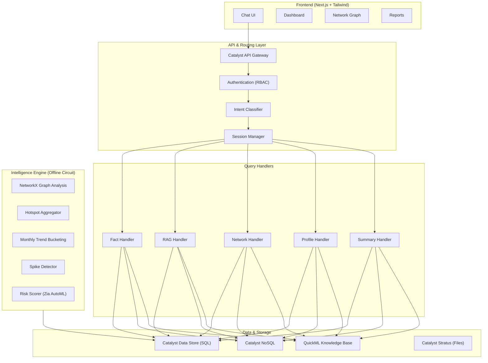

# SAHAYA AI: System Architecture (v2)

## Overview
A dual-path architecture combining a scheduled offline pipeline (for heavy ML/Graph compute) with a fast, lightweight online conversational layer. **v2** adds context-aware sessions, reasoning chains, suspect profiling with MO detection, and time-based trend analytics.

## 1. Frontend & Client Layer
- **Framework:** Next.js 16 + Tailwind CSS v4 (Premium Dark Mode Dashboard).
- **Hosting:** Catalyst Web Client Hosting / Slate.
- **Visuals:** Custom canvas-based `NetworkGraph` for force-directed suspect visualization.
- **TTS:** Web Speech API for English read-aloud (Zia TTS for Kannada in production).
- **Pages:** Chat, Dashboard, Network Graph, Reports.

## 2. API & Routing Layer (Online)
- **Gateway:** Catalyst API Gateway.
- **Auth:** Catalyst Authentication (RBAC for Investigator vs. Supervisor).
- **Intent Classifier:** Regex-based router classifying queries into 5 types: `fact`, `narrative`, `network`, `profile`, `summary`. Upgradeable to QuickML LLM Serving.
- **Session Manager:** In-memory session store with 10-turn history and entity tracking (suspect_id, district, fir_id, category). Resolves pronouns ("his cases", "that district") using session context. 30-minute TTL.

### Query Handlers
| Handler | Intent | Data Source | Output |
|---|---|---|---|
| **Fact Handler** | Statistics, counts, hotspots, trends, spikes | `Hotspot_Answers` table | Verified counts + spike alerts |
| **RAG Handler** | Narratives, MO patterns, case details | `Case_Narratives` (QuickML KB) | Cited passages + cross-references |
| **Network Handler** | Suspect connections, crime rings | `Suspect_Clusters` + `graph_data` | Graph JSON (nodes + links) |
| **Profile Handler** | Suspect dossier, repeat offenders | `Suspects` + `FIR_Records` + `Mappings` | Full profile + MO history + risk reasoning |
| **Summary Handler** | Case briefs, similar cases | `Case_Narratives` | Auto-summary + top-3 similar cases |

### Reasoning Chains
Every handler emits a `reasoning[]` array explaining **why** this answer was produced:
- Which table/documents were queried
- Which keywords/patterns matched
- Cross-references to other suspects/FIRs
- MO pattern matches across cases
- Spike detection rationale

## 3. Data & Storage Layer
- **Structured Data (Catalyst Data Store):**
  - `FIR_Records` — 80 FIRs with `investigation_status` and `modus_operandi`
  - `Suspects` — 40 profiles with risk scores
  - `Victims` — 98 victim records (NEW)
  - `FIR_Suspect_Mapping` — 146 co-accused links
  - `FIR_Victim_Mapping` — 98 victim links (NEW)
  - `Hotspot_Answers` — District/category aggregates
  - `Monthly_Hotspots` — Per-month breakdown for trend analysis (NEW)
  - `Suspect_Clusters` — Precomputed crime ring data
  - `Conversation_Sessions` — Session state for context-aware chat (NEW)
- **Unstructured Data (Catalyst NoSQL):** Raw FIR text, modus operandi descriptions.
- **Knowledge Base:** QuickML KB synced with NoSQL for RAG.
- **Files:** Catalyst Stratus for PDF exports and images.

## 4. The Intelligence Engine (Offline Circuit)
Orchestrated via **Catalyst Circuits** and **Job Scheduling**:
1. Pulls raw FIRs from Data Store.
2. Runs Graph clustering (NetworkX in **AppSail**) — detects connected components.
3. Aggregates hotspot data (district totals + monthly breakdown).
4. **Detects spikes** — flags district/category exceeding 1.5x state average.
5. Computes monthly deltas (month-over-month % change).
6. Evaluates suspect threat levels (**Zia AutoML** / rule-based fallback).
7. Writes all aggregated insights back to precomputed Data Store tables.

## 5. Value-Add Services
- **Zia Voice / Translate:** Kannada STT input + TTS output.
- **SmartBrowz:** Headless browser PDF rendering for official KSP reports.
- **Catalyst Pipelines:** CI/CD for all code.

## 6. Key Design Decisions
- **Zero-hallucination fact path:** All statistical answers come from precomputed `Hotspot_Answers`, never generated by LLM.
- **Reasoning transparency:** Every answer includes a step-by-step reasoning chain visible to the user via "Why this answer?" button.
- **MO-based profiling:** Crime ring FIRs share the same MO (80%) enabling repeat-offender pattern detection.
- **Context-aware conversation:** Session manager tracks entities across turns so follow-up queries resolve naturally.
- **Frontend-first development:** All features work with mock data immediately, wired to backend in Phase 5.
